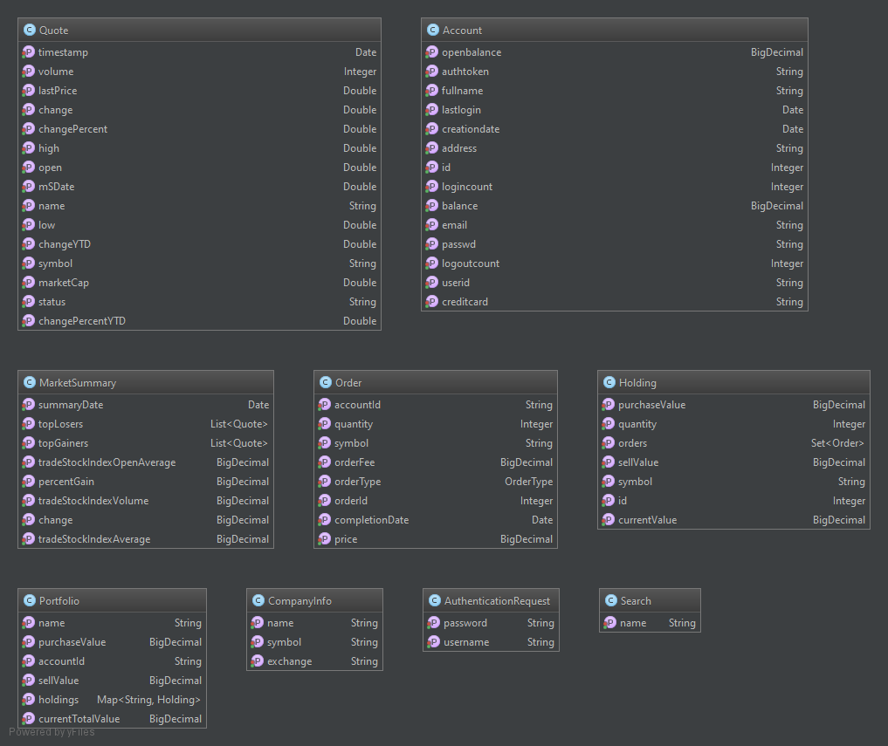

:compat-mode:
= Lab 04a - Identify the bounded contexts of the Monolith App

In this lab we'll identify the bounded contexts so that they can be easily extracted into microservices.

== Understanding the spring-trader monolith application

. Change to the lab directory:
+
----
$ cd $COURSE_HOME/day_01/session_05/lab_04a/springtrader-monolith
----
+
and import the project (via `pom.xml`) into your IDE of choice.

. Run the application

. Browse spring-trader on http://localhost:8080
+
Create a user account with at least $5000 balance, perform a few trades and check your portfolio.

. Domain classes
+
Inside your IDE, look at the domain classes (package `io.pivotal.springtrader.domain`).
+
Try to write down all the relations between those domain classes

+

== Decomposition into microservices

. Based on the domain model, identify how the Spring Trader monolith application should be split up.
+
