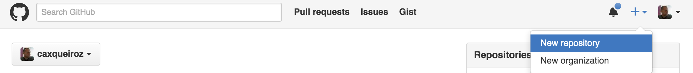
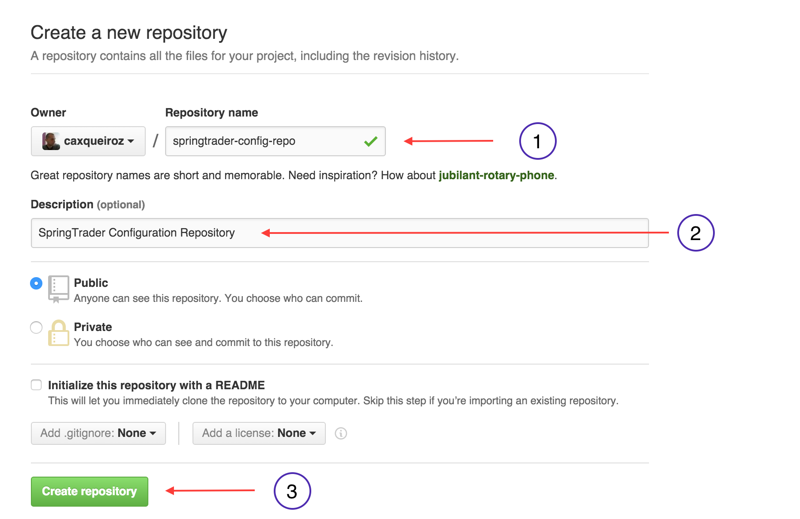
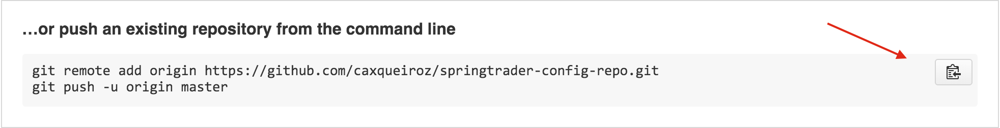
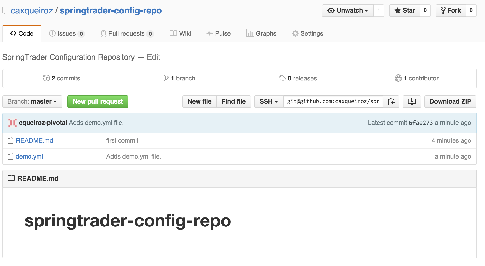

= Lab 06a - Deploying and Using Spring Cloud Config Server

Estimated time to complete: 30 minutes
[abstract]
--
Now we'll begin using the components found in Spring Cloud to implement patterns for distributed systems.
We'll be using Spring Cloud Config to centralize configuration for applications.
Our configuration will be stored in a GitHub repository, and served to our applications using the Spring Cloud Config Server.

In this lab, we'll do the following:

. Create a GitHub repository to store your configuration
. Create a Spring Cloud Config Server and test it with a basic sample application
--

NOTE: before starting this lab, you can stop all the applications you had started in the previous labs. You will not need them anymore.

This lab uses 4 different `yml` files. You can refer to the table below in case you would get confused.

[options="header"]
|=======
|File name |location |Purpose
|demo.yml | Config repository on github | configuration file for application `demo`
|bootstrap.yml | springtrader-config-client | information sent to config server before application starts
|manifest.yml |all projects deployed to Cloud Foundry | deployment information
|application.yml|all Spring Boot projects |Spring Boot configuration
|=======

== Create a GitHub repository to Store Configuration

. Change to the lab directory:
+
----
$ cd $COURSE_HOME/day_02/session_06/lab_06a/initial
----

. Create a directory for the configuration repo (*make sure it is outside $COURSE_HOME*):
+
----
mkdir config-repo
cd config-repo
----

. Initialize the Git repository:
+
----
$ git init
----

. In the repo, we are going to host the configuration file for a sample application called `demo`. It will be hosted into a file conveniently called `demo.yml`. Create `demo.yml` and paste the following into it:
+
[source,yml]
----
greeting: Hello
----

. Commit your changes as follows:
+
----
git add .
git commit -m "initial commit"
----

. Make sure you're logged in to your GitHub account, and create a new repository:
+

. Give the repo a name and description, and then click ``Create repository'':
+

. You can follow the instructions on the github page as shown below:
+

+
----
$ git remote add origin https://github.com/caxqueiroz/springtrader-config-repo.git
$ git push -u origin master
Counting objects: 3, done.
Delta compression using up to 4 threads.
Compressing objects: 100% (2/2), done.
Writing objects: 100% (3/3), 303 bytes | 0 bytes/s, done.
Total 3 (delta 0), reused 0 (delta 0)
To git@github.com:caxqueiroz/springtrader-config-repo.git
   3ffd637..6fae273  master -> master
----

. Refresh the browser to confirm that you have pushed your changes:
+

== Create a Spring Cloud Config Server

. Change to the lab directory:
+
----
$ cd $COURSE_HOME/day_02/session_06/lab_06a/initial/springtrader-config-server
----
+
and import the project (via `pom.xml`) into your IDE of choice.

. Open `pom.xml`. As you can see, your project has been configured for Spring Cloud already. Add a dependency on `spring-cloud-config-server`:
+
[source,xml]
----
<dependency>
  <groupId>org.springframework.cloud</groupId>
  <artifactId>spring-cloud-config-server</artifactId>
</dependency>
----

. Now open `io.springtrader.configserver.SpringtraderConfigServerApplication` and add the `@EnableConfigServer` annotation:
+
[source,java]
----
@SpringBootApplication
@EnableConfigServer  // <--- ADD THIS!
public class SpringtraderConfigServerApplication {

    public static void main(String[] args) {
        SpringApplication.run(SpringtraderConfigServerApplication.class, args);
    }
}
----

. Now open `src/main/resources/application.properties` and paste the following code (be sure to replace <yourUserName> with the one you created in this lab!):
+
----
server.port=8888
spring.cloud.config.server.git.uri= https://github.com/<yourUserName>/springtrader-config-repo.git
----

. Run the application
+
. Test the application in your web browser by connecting to http://localhost:8888/demo/default
You should be able to see your properties displayed similar to this:
+
[source,json]
----
{
   "name":"default",
   "label":"",
   "propertySources":[
      {
         "name":"https: //github.com/<yourUserName>/springtrader-config-repo.git/demo.yml",
         "source":{
            "greeting":"Hello"
         }
      }
   ]
}
----
+
As shown above, you should be able to see the `greeting` value that you have entered inside `demo.yml` on your git repository.
+
NOTE: `http://localhost:8888/<myApp>/default` displays properties for all managed applications. You already have properties for an application called `demo` and we will add more applications to the config server later in this lab.

Leave the Config Server running, the client will need it.

== Create the Sample Test Application
. Change to the lab directory:
+
----
$ cd $COURSE_HOME/day_02/session_06/lab_06a/initial/springtrader-config-client
----
+
and import the project (via `pom.xml`) into your IDE of choice.

. Open `pom.xml` and add the following dependency:
+
[source,xml]
----
<dependency>
  <groupId>org.springframework.cloud</groupId>
  <artifactId>spring-cloud-starter-config</artifactId>
</dependency>
----

. In the package `io.springtrader.configclient` create the class `GreetingController`, and into that class paste the following source code:
+
[source,java]
----
@RestController
public class GreetingController {

    @Value("${greeting}")
    String greeting;

    @RequestMapping("/")
    public String greeter() {
        return greeting + " World!";
    }

}
----

. In `src/main/resources` create a `bootstrap.properties` file and set the client's application name:
+
[source,java]
----
spring.application.name=demo
----

. Make sure the `config server` is still running. Launch the `config-client` application.  Test the client has succeeded in fetching its configuration by using your web browser to connect to http://localhost:8080. You should be able to see a "Hello World" message displayed.
+
----
Hello World!
----

NOTE: you might have noticed that the sample client does not specify the address of the config server. By default, it uses `localhost:8888`. You could override the default value inside `bootstrap.yml` by defining a property called `spring.cloud.config.uri`.

. Take a look at the Spring Environment to see how the `greeting` property is being resolved. You can connect to http://localhost:8080/env
The information you need is on the first line.
+
[source,json]
----
{
    "applicationConfig: [classpath:/bootstrap.properties]": {
        "spring.application.name": "demo"
    },
    "configService:https://github.com/caxqueiroz/springtrader-config-repo.git/demo.yml": {
        "greeting": "Hello"
    },

...

}
----
