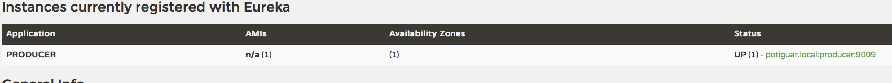
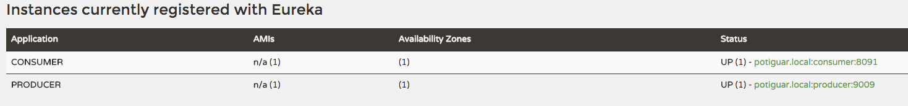

:compat-mode:
= Lab 06b - Leveraging Eureka for Service Discovery via Spring Cloud Netflix

Estimated time to complete: 30 minutes
[abstract]
--
Let's continue learning the components found in Spring Cloud to implement patterns for distributed systems.
We'll use Spring Cloud Netflix to deploy Eureka, which is a component offering service registration and discovery.

In this lab, we'll do the following:

. Create a Eureka server
. Create two applications, a ``producer'' and a ``consumer,'' wire them up using Eureka, and test them.
--

== Introduction

. Before starting this lab, you can stop all the web applications that you had started in the previous labs. You will not need them anymore.

. There are four different web applications to be run locally in this lab. To avoid any confusion, we have listed all the port numbers below:

[options="header"]
|=======
|Application |port number
|Eureka Server |8761
|Config Server |8888
|Producer |8080 (default)
|Consumer |8091
|=======

== Creating a Eureka Server

. Change to the lab directory:
+
----
cd $COURSE_HOME/day_02/session_06/lab_06b/initial/
----
+
and import all 4 projects into your IDE. For the first part of this lab, we will work on `springtrader-eureka`

. Open `pom.xml`, change the parent POM to the `spring-cloud-starter-parent`:
+
[source,xml]
----
<parent>
  <groupId>org.springframework.cloud</groupId>
  <artifactId>spring-cloud-starter-parent</artifactId>
  <version>1.0.2.RELEASE</version>
  <relativePath/>
  <!-- lookup parent from repository -->
</parent>
----

. Add a dependency on `spring-cloud-starter-eureka-server`:
+
[source,xml]
----
<dependency>
  <groupId>org.springframework.cloud</groupId>
  <artifactId>spring-cloud-starter-eureka-server</artifactId>
</dependency>
----

. Also, update the `spring-boot-maven-plugin` configuration to indicate that jars containing JAX-RS resources should be unpacked:
+
[source,xml]
----
<plugin>
  <groupId>org.springframework.boot</groupId>
  <artifactId>spring-boot-maven-plugin</artifactId>
  <configuration>
    <requiresUnpack>
      <dependency>
        <groupId>com.netflix.eureka</groupId>
        <artifactId>eureka-core</artifactId>
      </dependency>
      <dependency>
        <groupId>com.netflix.eureka</groupId>
        <artifactId>eureka-client</artifactId>
      </dependency>
    </requiresUnpack>
  </configuration>
</plugin>
----

NOTE: the above workaround will not be necessary starting from `spring-cloud-netflix` version 1.3 (see https://github.com/spring-cloud/spring-cloud-netflix/issues/399)

. In `io.springtrader.eureka.SpringtraderEurekaApplication`, add the `@EnableEurekaServer` annotation:
+
[source,java]
----
@SpringBootApplication
@EnableEurekaServer    // <-- ADD THIS!
public class SpringtraderEurekaApplication {

    public static void main(String[] args) {
        SpringApplication.run(SpringtraderEurekaApplication.class, args);
    }
}
----

. Open `src/main/resources/application.yml` and paste in the following source:
+
[source,yml]
----
server:
  port: 8761

eureka:
  instance:
    hostname: localhost
  client:
    registerWithEureka: false
    fetchRegistry: false
    serviceUrl:
      defaultZone: http://${eureka.instance.hostname}:${server.port}/eureka/
----

. Run the application and visit http://localhost:8761
+
You should see the below console:
+
image::../../../Common/images/eureka_1.png[]

== Update the Config Server configuration

. The Producer Service relies on the Config Server that you have used in the previous lab. We'll use it to consistently configure the Eureka Client across all of our applications.
+
We have placed for your convenience an up-to-date version of the config server inside project `lab16-springtrader-config-server`. You can use that one from now on.

. You had previously created a git repository with a single configuration file inside. In your git config repository, open `demo.yml` and add the following:
+
[source,yml]
----
configserver: true

eureka:
  instance:
    leaseRenewalIntervalInSeconds: 10
    metadataMap:
      instanceId: ${vcap.application.instance_id:${spring.application.name}:${server.port:8080}}
----

. push your changes on git as shown below:
+
----
git add .
git commit -m "adds eureka config client"
git push origin master
----

. `lab_06b-springtrader-config-server` has been placed in your `lab_06b/initial` folder.
+
Import it in your IDE if you have not done so already.
. Open `src/main/resources/application.properties` and make sure the path to your github repository is correct

. Run the config server application and open your browser on http://localhost:8888/demo/default
+
Your Eureka properties should be displayed.

== Create and Register the Producer Service

. In your IDE, open the `lab_06b-springtrader-producer` project

. Open `pom.xml`, change the parent POM to the `spring-cloud-starter-parent`:
+
[source,xml]
----
<parent>
  <groupId>org.springframework.cloud</groupId>
  <artifactId>spring-cloud-starter-parent</artifactId>
  <version>1.0.2.RELEASE</version>
  <relativePath/>
  <!-- lookup parent from repository -->
</parent>
----

. Add a dependency on `spring-cloud-starter-eureka`:
+
[source,xml]
----
<dependency>
  <groupId>org.springframework.cloud</groupId>
  <artifactId>spring-cloud-starter-eureka</artifactId>
</dependency>
----

. In the package `io.springtrader.producer`, create the class `ProducerController`.
Into that class paste the following code:
+
[source,java]
----
@RestController
public class ProducerController {

    private Log log = LogFactory.getLog(ProducerController.class);
    private AtomicInteger counter = new AtomicInteger(0);

    @RequestMapping(value = "/", produces = "application/json")
    public String produce() {
        int value = counter.getAndIncrement();
        log.info("Produced a value: " + value);

        return String.format("{\"value\":%d}", value);
    }

}
----

. Now open `io.springtrader.producer.SpringtraderProducerApplication` and add the `@EnableDiscoveryClient` annotation:
+
[source,java]
----
@SpringBootApplication
@EnableDiscoveryClient  // <--- ADD THIS!
public class SpringtraderProducerApplication {

    public static void main(String[] args) {
        SpringApplication.run(SpringtraderProducerApplication.class, args);
    }
}
----

. Create the file `src/main/resources/bootstrap.yml` and paste in the following source:
+
----
spring:
  application:
    name: producer
----

. Run the producer application

. Ten seconds after the producer application finishes startup, you should see it log its registration with Eureka:
+
----
2016-01-12 16:45:27.148  INFO 2101 --- [pool-4-thread-1] com.netflix.discovery.DiscoveryClient    : DiscoveryClient_PRODUCER/potiguar.local:producer:9009 - Re-registering apps/PRODUCER
2016-01-12 16:45:27.148  INFO 2101 --- [pool-4-thread-1] com.netflix.discovery.DiscoveryClient    : DiscoveryClient_PRODUCER/potiguar.local:producer:9009: registering service...
2016-01-12 16:45:27.209  INFO 2101 --- [pool-4-thread-1] com.netflix.discovery.DiscoveryClient    : DiscoveryClient_PRODUCER/potiguar.local:producer:9009 - registration status: 204
----
+
You should also be able to refresh http://localhost:8761 in the browser and see the producer registered:
+

== Create and Register the Consumer Service

. In your IDE, open `lab_06b-springtrader-consumer`

. Open its `pom.xml` file and change the parent POM to `spring-cloud-starter-parent`:
+
[source,xml]
----
<parent>
  <groupId>org.springframework.cloud</groupId>
  <artifactId>spring-cloud-starter-parent</artifactId>
  <version>1.0.2.RELEASE</version>
  <relativePath/>
  <!-- lookup parent from repository -->
</parent>
----

. Add a dependency on `spring-cloud-starter-eureka`:
+
[source,xml]
----
<dependency>
  <groupId>org.springframework.cloud</groupId>
  <artifactId>spring-cloud-starter-eureka</artifactId>
</dependency>
----

. In the package `io.springtrader.consumer`, create the class `ProducerResponse`, and into that class paste the following code:
+
[source,java]
----
public class ProducerResponse {
    private int value;

    public void setValue(int value) {
        this.value = value;
    }

    public int getValue() {
        return value;
    }
}
----

. Also in the package `io.springtrader.consumer.controller`, create the class `ConsumerController`, and into that class paste the following code:
+
[source,java]
----
@RestController
public class ConsumerController {

    @Autowired
    DiscoveryClient discoveryClient;

    @RequestMapping(value = "/", produces = "application/json")
    String consume() {
        InstanceInfo instance = discoveryClient.getNextServerFromEureka("PRODUCER", false);

        RestTemplate restTemplate = new RestTemplate();
        ProducerResponse response = restTemplate.getForObject(instance.getHomePageUrl(), ProducerResponse.class);

        return String.format("{\"value\":%d}", response.getValue());
    }

}
----

. Now open `io.springtrader.consumer.SpringtraderConsumerApplication` and add the `@EnableDiscoveryClient` annotation:
+
[source,java]
----
@SpringBootApplication
@EnableDiscoveryClient  // <--- ADD THIS!
public class SpringtraderConsumerrApplication {

    public static void main(String[] args) {
        SpringApplication.run(SpringtraderConsumerrApplication.class, args);
    }
}
----

. In `src/main/resources/application.properties`, set the `server.port` property:
+
----
server.port=8091
----

. Create the file `src/main/resources/bootstrap.yml` and paste in the following source:
+
----
spring:
  application:
    name: consumer
----

. Run the consumer application

. Ten seconds after the consumer application finishes startup, you should see it log its registration with Eureka:
+
----
2016-01-12 16:58:25.130  INFO 3696 --- [pool-4-thread-1] com.netflix.discovery.DiscoveryClient    : DiscoveryClient_CONSUMER/potiguar.local:consumer:8091 - Re-registering apps/CONSUMER
2016-01-12 16:58:25.130  INFO 3696 --- [pool-4-thread-1] com.netflix.discovery.DiscoveryClient    : DiscoveryClient_CONSUMER/potiguar.local:consumer:8091: registering service...
2016-01-12 16:58:25.152  INFO 3696 --- [pool-4-thread-1] com.netflix.discovery.DiscoveryClient    : DiscoveryClient_CONSUMER/potiguar.local:consumer:8091 - registration status: 204
----
+
You should also be able to refresh http://localhost:8761 in the browser and see the producer registered:
+

. Open a browser tab on the consumer application (http://localhost:8091). It should show that it is receiving values from the producer:
+
[source,json]
----
{
	"value":0
}
----
