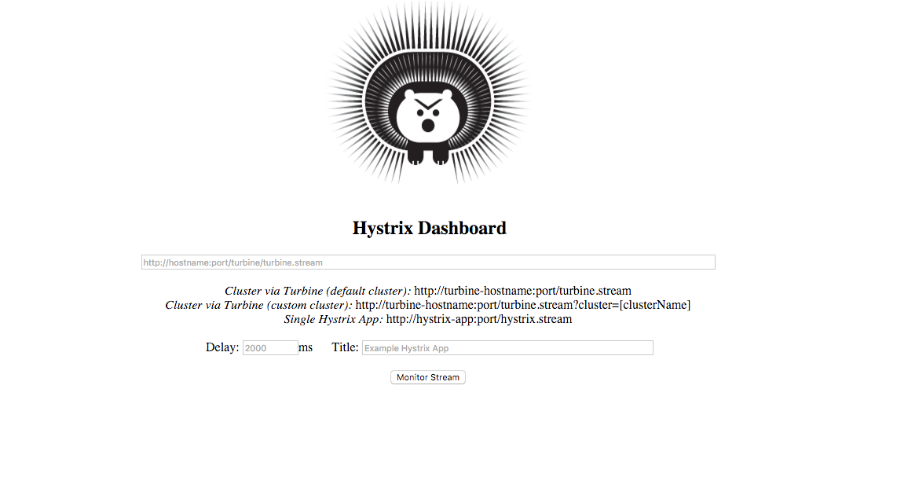
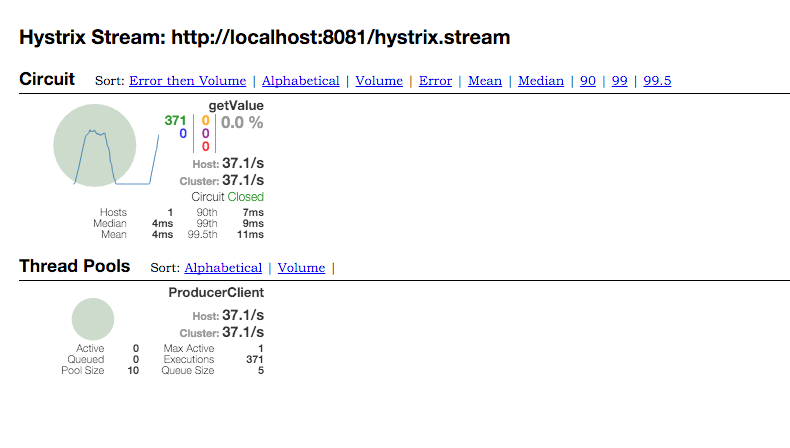
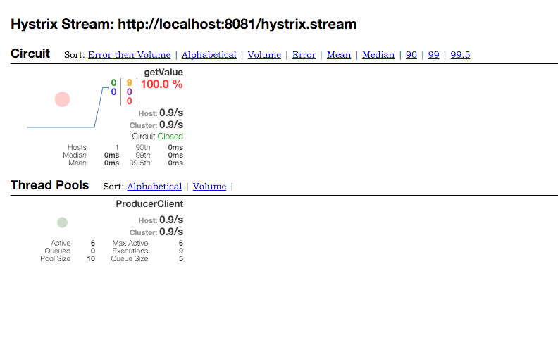

= Lab 07d - Monitoring Circuit Breakers with Hystrix Dashboard

Estimated time to complete: 20 minutes
[abstract]
--
We will now monitor what's happening in our Circuit Breakers by using Netflix Hystrix Dashboard.

In this lab, we'll do the following:

. Run everything that we created in  link:../../session_07/lab_07c/lab_07c_fault_tolerance.adoc[Lab 07c].
. Create a Hystrix Dashboard
. Kill both of the producers and watch the circuit open in the Dashboard.
. Restart a producer and watch the circuit close in the Dashboard.
--

== Setup

. Make sure you've completed link:../../session_07/lab_07c/lab_07c_fault_tolerance.adoc[Lab 07c] and have everything still running.

== Building the Hystrix Dashboard

. The project `springtrader-hystrix-dashboard` has been placed inside `$COURSE_HOME/day_02/session_07/lab_07d/initial/`. Import it inside your IDE of choice.

. Add the following dependency to `pom.xml`:
+
[source,java]
----
<dependency>
	<groupId>org.springframework.cloud</groupId>
	<artifactId>spring-cloud-starter-hystrix-dashboard</artifactId>
</dependency>
----

. Add a `@EnableHystrixDashboard` to the class `io.pivotal.springcloud.hystrixdashboard.HystrixDashboardApplication`.

. Paste the following inside `src/main/resources/application.yml` :
+
----
server:
  port: 7979
----

. Run the application by launching `HystrixDashboardApplication`

. Now, access the Hystrix Dashboard at http://localhost:7979/hystrix.
Enter `\http://localhost:8091/hystrix.stream` into the text field  and click the ``Monitor Stream.''
+

. Access the consumer application at `http://localhost:8091/` several times and check that the circuit breaker is registering successful requests.
+

== Fallback

. Shut down both of the producer processes.

. Test the consumer application and show that it is only emitting the fallback value of `-1`.

. You should also see the circuit breaker is registering short-circuited requests.
+

== Recovery

. Restart one of the producer processes. Wait for it to register with Eureka.

. Test the consumer application and show that eventually recovers and starts hitting the new producer process. This can take up to one minute as the Eureka and Ribbon caches repopulate.

. Continue to watch the dashboard. You should also see the circuit breaker dashboard show the recovery.
