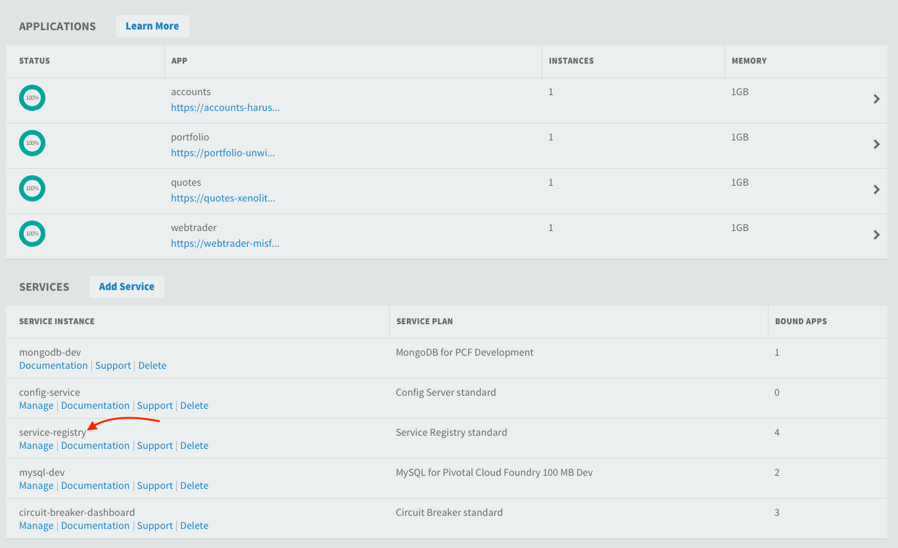
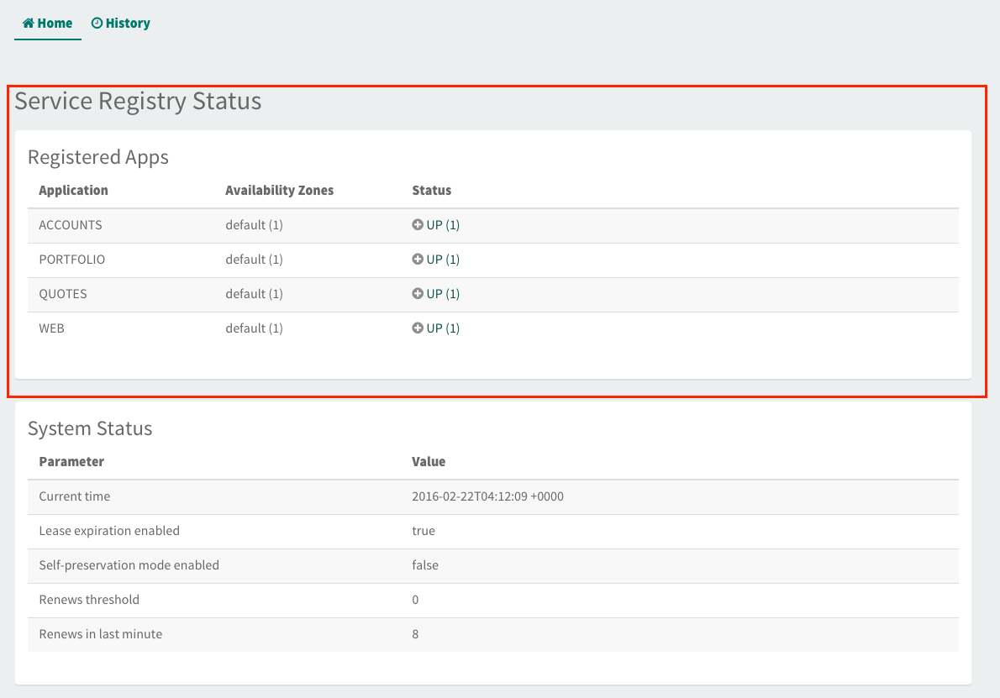
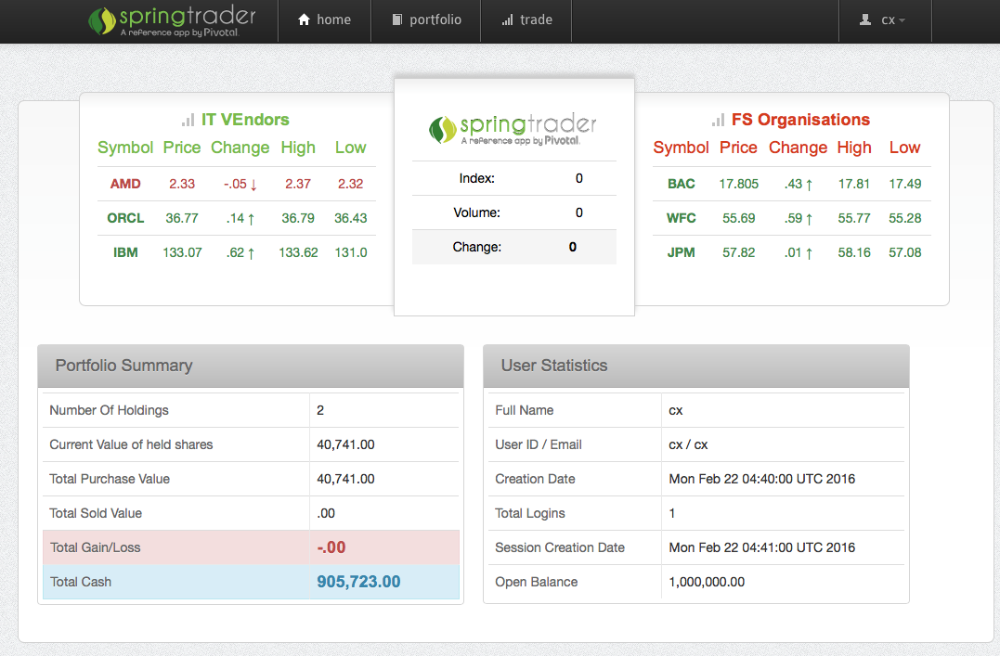
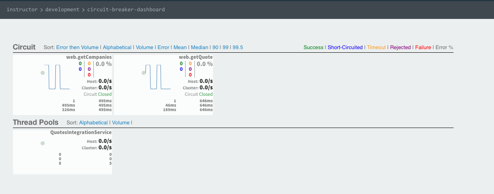

= Lab 09a - Deploying the StringTrader Microservices version Application
[abstract]

--
We will now deploy the SpringTrader application you have been developing. We will use the Web microservices (provided) together with the services you have already built and we will deploy them on Pivotal Cloud Foundry. 
--

== Copying the 3 services  
. Copy the 3 services: Account, Quotes and Portfolio into *initial* folder.
+
----
cd $COURSE_HOME/day_02/session_09/lab_09a/initial/

cp -R ../complete/quotes .
cp -R ../complete/accounts .
cp -R ../complete/portfolio .
----

== Starting Spring Cloud Services on Pivotal Cloud Foundry

. Create Eureka service (service-registry):
+
----
$ cf create-service p-service-registry standard service-registry
----

. Initialise Eureka service by clicking on the service Manage link. 

. Create Hysterix Dashboard service (circuit-breaker-dashboard):
+
----
$ cf create-service p-circuit-breaker-dashboard standard circuit-breaker-dashboard
----

. Initialise Hysterix dashboard by clicking on the service Manage link. 

. Make sure all manifest.yml files define the app memory with 1G. 
+
----
memory: 1G
----

== Deploying the Application

. Create deploy.sh(bat) file. 
+
----
cf push -f quotes/manifest.yml
cf push -f accounts/manifest.yml
cf push -f portfolio/manifest.yml
cf push -f web/manifest.yml
----

.. If you are using Unix add *#!/bin/sh* at the first file line. 

. Run the deploy command. 
+
----
./deploy.sh (or deploy.bat)
----

+
----
App started

OK

App webtrader was started using this command `CALCULATED_MEMORY=$($PWD/.java-buildpack/open_jdk_jre/bin/java-buildpack-memory-calculator-2.0.1_RELEASE -memorySizes=metaspace:64m.. -memoryWeights=heap:75,metaspace:10,native:10,stack:5 -memoryInitials=heap:100%,metaspace:100% -totMemory=$MEMORY_LIMIT) && JAVA_OPTS="-Djava.io.tmpdir=$TMPDIR -XX:OnOutOfMemoryError=$PWD/.java-buildpack/open_jdk_jre/bin/killjava.sh $CALCULATED_MEMORY -Djava.security.egd=file:///dev/urandom" && SERVER_PORT=$PORT eval exec $PWD/.java-buildpack/open_jdk_jre/bin/java $JAVA_OPTS -cp $PWD/.:$PWD/.java-buildpack/spring_auto_reconfiguration/spring_auto_reconfiguration-1.10.0_RELEASE.jar org.springframework.boot.loader.JarLauncher`

Showing health and status for app webtrader in org instructor / space development as instructor...
OK

requested state: started
instances: 1/1
usage: 1G x 1 instances
urls: webtrader-nonbiological-bluebonnet.pcf12.cloud.fe.pivotal.io
last uploaded: Mon Feb 22 04:33:06 UTC 2016
stack: cflinuxfs2
buildpack: java_buildpack_offline

     state     since                    cpu    memory       disk          details
#0   running   2016-02-22 01:34:38 PM   0.0%   700K of 1G   27.8M of 1G
----

== Testing it out

. Check if all services are registered with Eureka server. Click on Manage service. 
+

. See all four services registered with Eureka.  
+

. In browser, go to the *webtrader* URL shown during cf push 
+

. Finally, you can check if Hysterix is working. Checking its dashboard. 
+

